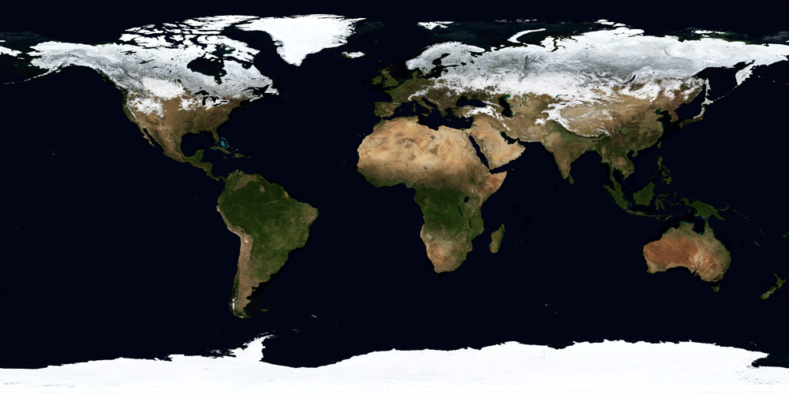

## Background

Seasonality is one of the most influencing pattern on earth. Global variation in seasonal climate is arguably the most dominant external driver in natural systems that underpins the formation of the earth’s biomes and almost all biological processes therein. Reproduction, food-web structures, host-pathogen interactions, movements, all vary with the seasons. Yet, not only the living world is affected, geological processes such as erosion, river dynamics, earthquakes are somewhat driven or triggered by seasonal pattern such as snowmelt, monsoon and rainfall.

And what about humans? Although we have largely decoupled our dependency on seasonal variation in climate, by e.g. using cloths that allow us to remain in cold hostile regions year-round and by exploiting global food resources. However certain aspects of our social and economic life are still meticulously tuned to global seasonality. And considering the recent COVID-19 crisis and natural seasonal variation on our immunocompetence, we are reminded once again how seasonality affects our life in the Anthropocene. 

With climate change, we don’t only see changes (and mainly an increase) in the mean annual temperature, but we have also observed changes in the seasonal dynamics. For example, in many regions on the northern hemisphere, the summer period is becoming longer with shorter transitions (spring and autumn) and milder winters. In some regions the predictability changes with consequences for species that are adapted to highly predictable change (such as migratory birds or hibernating animals). Often the changes occurred in specific dimensions of the seasonal dynamic such as the start if the warmup or the monsoon. In other regions, we see changes in the length of the reproductive season coupled with higher primary productivity and a stronger difference between summer and winter temperatures. With such a high diversity of change, we expect an equally high diversity of consequences.

## Objectives

During the autumn school I would like to invite scientists from various fields and with a broad interest including economy, sociology and human health, as well as the climatology, geology and biology. Together, I would like to discuss and develop a framework that allows describing what dimension of seasonality affect the various systems and what consequences we predict with ongoing climate change.

Besides working towards a review (potentially data driven) and a conceptual framework for publication we could record our discussion, perform individual interviews during the discussion to later on show how we developed the ideas, what we struggle with and what our new insights are working together as an interdisciplinary team. This could become an outreach product accompanying a publication and illustrating our work within the Geo.X network.

## Contact person
Simeon Lisovski (simeon.lisovski@awi.de)