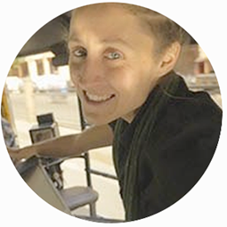
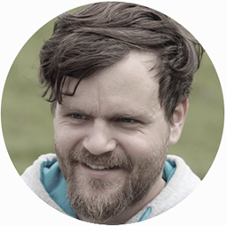

```{r include = FALSE}
knitr::opts_chunk$set(eval = FALSE, collapse = TRUE, comment = NA, tidy = FALSE)
knitr::opts_chunk$set(fig.width=6, fig.height=6) 
```

<!--html_preserve-->

<!--/html_preserve-->

<center>Lisa Rheinheimer ([mail](lisa.rheinheimer@gfz-potsdam.de))<center>

<!--html_preserve-->

<!--/html_preserve-->

<center>Tabea Rettelbach ([mail](tabea.rettelbach@awi.de))<center>

<!--html_preserve-->

<!--/html_preserve-->

<center>Theresa Frommen ([mail](theresa.frommen@hu.de))<center>

<!--html_preserve-->

<!--/html_preserve-->

<center>Niklas Kitzmann ([mail](kitzmann@pik-potsdam.de))<center>

<!--html_preserve-->

<!--/html_preserve-->

<center>Simeon Lisovski ([mail](simeon.lisovski@awi.de))<center>